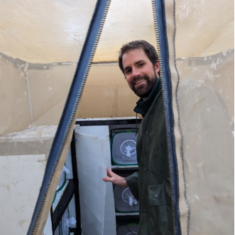
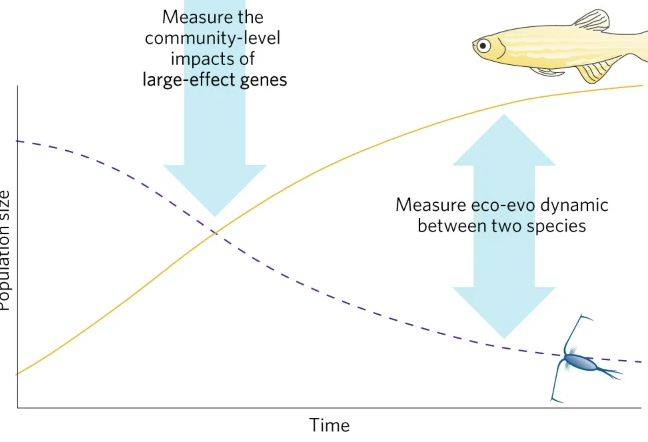
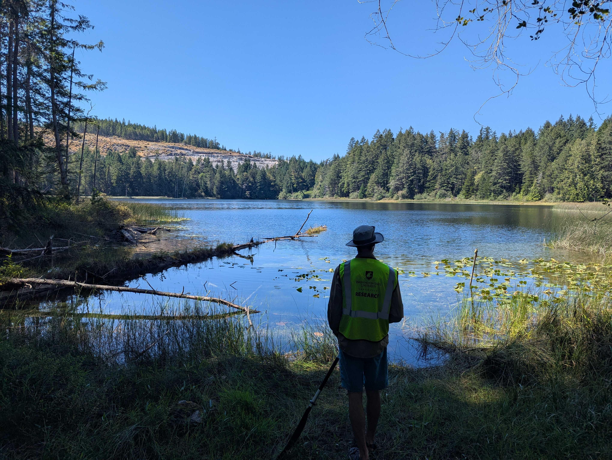

# Exploring how organisms respond to global change in an ecological context

## Research interests

Broadly, I am interested in how species are responding to the unintended natural experiment of global change driven by humans. I'm motivated to explore how **multiple stressors** impact species responses and how these responses **change across time and space**. In exploring these responses, I study **evolution on rapid time scales** and **plasticity** as responses to novel environmental conditions.

These research themes are part of the broader intersection of ecology and evolution. Until quite recently, these fields in biology have operated in isolation but we now recognize that they take place on similar time scales.[^1][^2] This means that interactions between species and their environment (ecology) can both cause and be caused by evolution.[^3] I seek to use this framework of **Eco-evo dynamics** to address major questions confronting biology including responses to climate change and global biodiversity declines.

[^1]: Hairston Jr, N. G., Ellner, S. P., Geber, M. A., Yoshida, T., & Fox, J. A. (2005). Rapid evolution and the convergence of ecological and evolutionary time. *Ecology Letters*, *8*(10), 1114–1127. <https://doi.org/10.1111/j.1461-0248.2005.00812.x>

[^2]: Hendry, A. P., & Kinnison, M. T. (1999). [Perspective: The Pace of Modern Life: Measuring Rates of Contemporary Microevolution]{.smallcaps}. Evolution, 53(6), 1637–1653. <https://doi.org/10.1111/j.1558-5646.1999.tb04550.x>

[^3]: Hendry, A. P. (2016). Eco-evolutionary Dynamics. Princeton University Press. <https://doi.org/10.1515/9781400883080>

Currently in my PhD research in [Seth Rudman's lab](https://sites.google.com/view/rudmanlab/home), I have focused on the following themes and projects that form both my dissertation work and inform my broader interests:

### Evolutionary responses to winter and trade-offs with novel stressors

-   Winter is challenging for ectotherms and the harsh conditions are likely a strong driver of divergence among populations. When conditions covary with other, novel stressors there is a strong potential for physiological trade-offs. We investigated evolution across winter and trade-offs with insecticide resistance using field populations of fruit flies (*Drosophila melanogaster*)*.* See [what we found in this paper](https://academic.oup.com/evolut/article/80/1/56/8280391)!

In addition to allele frequency shifts in physiology that enable overwintering success, it is likely that behavioral divergence among populations also plays a strong role. By using choice trial set ups with fall-collected fruit flies, we tested for the evolution of food choice and nutritional variation in overwintering success.

### Factors underlying the evolution of plasticity

-   Plasticity, or the flexibility of traits of an individual, can be an important mechanism of species persistence under changing climates. Importantly however, this capacity can evolve among populations. The extent to which the evolution of plasticity is beneficial or when it is maladaptive to populations, however, is not clear. We tested how broad level evolutionary processes of selection for insecticide resistance and gene flow affected the evolution of thermal and insecticide plasticity. Read about our findings from this project in [this pre-print](https://www.biorxiv.org/content/10.64898/2026.04.26.720922v2)!

### Eco-evolutionary dynamics following ecological speciation

The species-pair stickleback species is a fascinating case study of ecological character displacement and speciation. But what happens to the broader ecological community following speciation? How might that affect populations of primary prey species following divergence in the stickleback predator?

Here is where eco-evo dynamics can explain these outcomes: when strong evolutionary events take place in parallel, they provide a natural experiment to test how adaptation can subsequently feedback to affect the evolution of other species.

Currently, we are testing for evolutionary divergence in the diaptomid copepod *Skistodiaptomus oregonensis* in response to ecological speciation of the threespine stickleback *Gasterosteus aculeatus* fish in coastal British Columbia lakes. We are testing for phenotypic divergence of life history traits in copepods using common garden rearing. Concurrently we are testing for genetic evidence using a genome-wide sequencing approach that can reveal population level divergence and potential signatures of selection.

------------------------------------------------------------------------

### Previous research:

My previous research at Case Western Reserve University in Cleveland, OH with [Ryan Martin](https://www.martinevolutionaryecologylab.com/) investigated responses of rapid adaptation and evolutionary ecology in the realm of **urbanization** in two ways:

1.  Using the urbanization gradient as a 'space for time substitution' to explore how urban populations are evolving to the urban heat island compared to non-urban populations, I've used populations of a native ant species to explore the evolution of **thermal physiology** to the urban heat island during **winter**. You can find the link to this paper [here](https://www.sciencedirect.com/science/article/pii/S0306456523001328)

    {width="222"}

2.  I've used populations of a Collembolan (springtail) within a single urban area to test how environmental variation of **multiple traits (temperature and salinity)** at small spatial scales affects the evolution of physiological traits. You can find the link to this paper [here](https://academic.oup.com/biolinnean/advance-article-abstract/doi/10.1093/biolinnean/blae038/7636753)

Presently, I aim to continue exploring adaptation across seasons with a focus on the overwintering period for insects, adaptation to multiple stressors, and tradeoffs in physiological traits. To expand my research I am interested in how these responses fit into the **dynamics** between ecology and evolution (eco-evo dynamics) and how responses of one species can feedback to influence other species, communities of organisms, and entire ecosystems.

------------------------------------------------------------------------

## Influential papers, work, and media;

These are a few selected papers, books, and projects that have influenced my thinking and that continue to excite me with new ideas when I review them!

-   **Papers** (in no particular order):

    -   [*The Pace of Modern Life: Measuring Rates of Contemporary Microevolution*](https://academic.oup.com/evolut/article/53/6/1637/6758085)*;* Hendry and Kinnison, 1999

    -   [*Evolution in Cities*](https://www.annualreviews.org/content/journals/10.1146/annurev-ecolsys-012021-021402)*;* Diamond and Martin, 2021

    -   [*Genomic Evidence of Rapid and Stable Adaptive Oscillations over Seasonal Time Scales in Drosophila*](https://dx.plos.org/10.1371/journal.pgen.1004775); Bergland et al. 2014

    -   [*Direct observation of adaptive tracking on ecological time scales in Drosophila*](https://www.science.org/doi/full/10.1126/science.abj7484)*;* Rudman et al. 2022

    -   [*Ecological Character Displacement and Speciation in Sticklebacks*](https://www.jstor.org/stable/2462389)*;* Schluter and MacPhail, 1992

    -   [*The Measurement of Selection on Correlated Characters*](https://www.jstor.org/stable/2408842)*;* Lande and Arnold, 1983

    -   [*Cross-tolerance and Cross-talk in the Cold: Relating Low Temperatures to Desiccation and Immune Stress in Insects*](https://doi.org/10.1093/icb/ict004)*;* Sinclair et al. 2013

    -   [*The Integrative Physiology of Insect Chill Tolerance*](https://www.annualreviews.org/content/journals/10.1146/annurev-physiol-022516-034142); Overgaard and MacMillan, 2011

    -   [*Climate Change and Evolutionary Adaptation*](https://www.nature.com/articles/nature09670); Hoffman and Sgrò, 2011

    -   [*Soco-eco-evo dynamics in cities*](10.1111/eva.13065)*;* Des Roches et al. 2021

-   **Books**:

    -   Biochemical Adaptation by Peter Hochachka and George Somero

    -   Eco-Evolutionary Dynamics by Andrew Hendry

    -   Urban Evolution; edited by Marta Szulkin

    -   Phenotypic Plasticity: Functional and Conceptual Approaches; edited by Thomas DeWitt and Samuel Scheiner

    -   Low Temperature Biology of Insects; edited by David Denlinger and Richard Lee

    -   The Origins of Theoretical Population Genetics; William Provine

    -   The Structure of Scientific Revolutions; Thomas Kuhn

-   **Projects / Systems / Ideas**:

    -   Global experiments on rapid adaptation and experimental evolution using *Arabidopsis* by [Moi Exposito-Alonso's lab group](https://www.moisesexpositoalonso.org/grene-net)

    -   [Experimental reintroduction of stickleback ecotypes to Alaskan lakes](https://alaskastickleback.com/) (led by Andrew Hendry, Catherine Peichel, Daniel Bolnick, among many others)

    -   Food web resilience using an experimental eco-evo system (aphid - wasp - plant) ([Matt Barbour](https://www.mattbarbour.com/research-projects))

-   **Podcasts and video series**:

    -   [Big Biology Podcast](www.bigbiology.org)

    -   [Science Friday](https://www.sciencefriday.com/science-friday-podcasts/)

    -   [Okay, but birds](https://www.okaybutbirds.com/about)

    -   [Steve Mould](https://www.youtube.com/@SteveMould)

    -   [PBS Eons](https://www.youtube.com/@eons)
